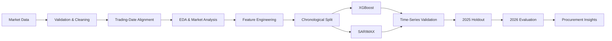
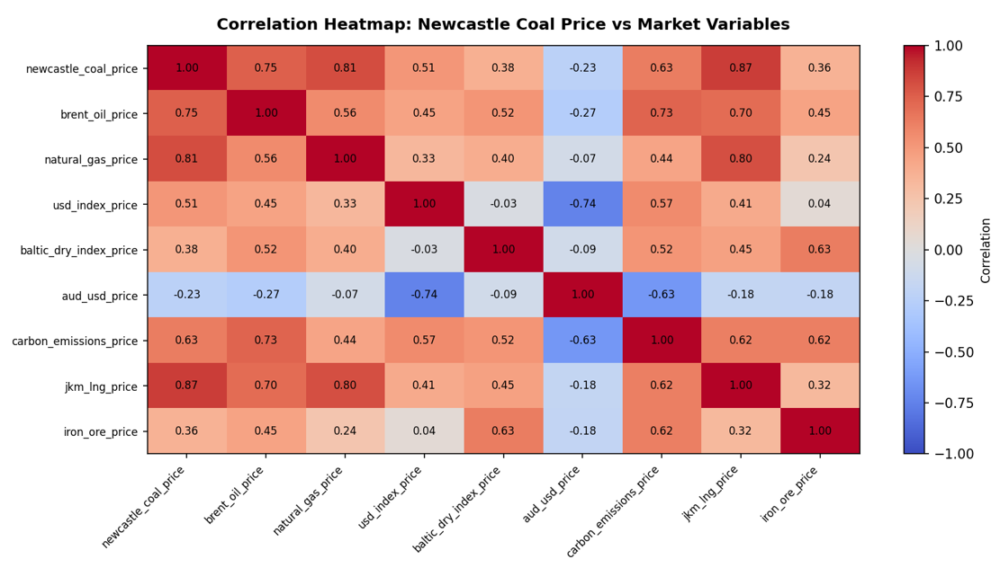
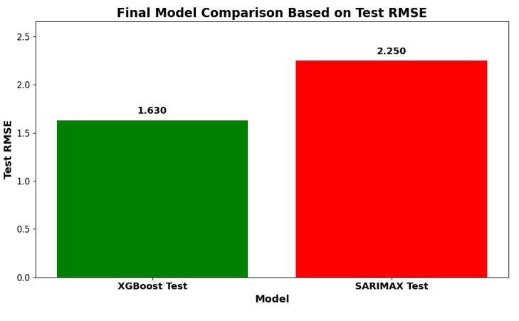
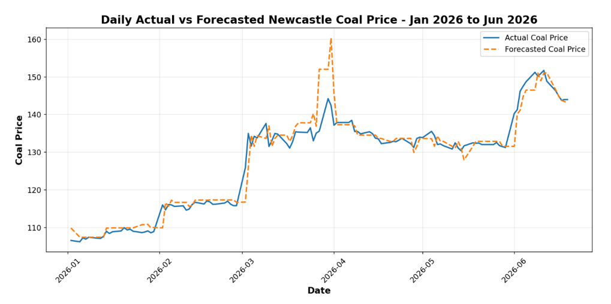

# 🔥 Newcastle Coal Price Forecasting & Procurement Optimization

### Multivariate commodity forecasting with market signals, time-aware validation, XGBoost and SARIMAX

<p>
  
  
  
  
  
  
</p>

> An end-to-end forecasting project designed to understand Newcastle coal price dynamics and convert model output into practical procurement and price-risk decisions.

---

## 🎯 Business Problem

Coal prices do not move in isolation.

Newcastle Coal Futures are influenced by the wider energy and commodity system — LNG, natural gas, crude oil, freight conditions, currencies, carbon pricing and broader industrial demand.

Rather than treating this as a simple univariate forecasting problem, I modelled:

**historical coal behaviour + external market signals + temporal structure**

The objective was to answer a more useful question than simply *“What will the next price be?”*

> **Can market information improve our understanding of coal-price movement enough to support better procurement timing, contract planning and risk management?**

---

## 🧠 Modelling Strategy

The project was built around three principles.

### 1️⃣ Preserve the time structure

Random train/test splitting was intentionally avoided.

```text
2015 ───────────────────── 2023 │ 2024 │ 2025 │ Jan–Jun 2026
           TRAIN                  VALID   TEST     EVALUATION
```

Earlier observations always predict later observations.

I also used `TimeSeriesSplit` to assess whether model performance remained stable across different historical market periods.

### 2️⃣ Model the market around coal

The final feature set contains **14 predictors**:

```text
🌍 External Market Signals
├── Brent Oil
├── Natural Gas
├── JKM LNG
├── US Dollar Index
├── AUD/USD
├── Baltic Dry Index
├── Carbon Emissions Futures
└── Iron Ore

📅 Calendar Structure
├── Year
├── Month
└── Quarter

⏱ Coal Price Memory
├── Lag 1
├── Lag 7
└── Lag 30
```

This allows the model to learn from both **recent coal-price behaviour** and the broader market environment.

### 3️⃣ Benchmark complexity

A sophisticated model should earn its complexity.

The workflow therefore compared:

* **Persistence baseline** — previous available coal price
* **XGBoost** — nonlinear machine-learning model
* **SARIMAX** — statistical time-series model with exogenous variables

This is important because short-term commodity prices can be highly persistent. A complex model is useful only when it adds value beyond a simple benchmark.

---

## 🔄 End-to-End Workflow



---

## 🔎 Understanding the Market

Before modelling, I analysed:

`Price Regimes` · `Volatility` · `Seasonality` · `Market Correlations`

JKM LNG, Natural Gas and Brent Oil showed some of the strongest positive historical relationships with Newcastle coal, while AUD/USD showed a negative relationship.



> **Correlation was treated as a diagnostic signal, not evidence of causality.**

Energy variables can move together during the same macroeconomic shock, so feature selection was based on both statistical evidence and market logic.

---

## ⚙️ Model Design

### XGBoost

XGBoost was selected as the primary machine-learning model because coal prices can respond to several variables simultaneously and those relationships are not necessarily linear.

Conceptually:

```text
Coal Price
   ↓
Recent Price Behaviour
+ Energy Conditions
+ LNG / Gas Markets
+ Currency Movement
+ Freight Pressure
+ Commodity Regime
```

### SARIMAX

SARIMAX was used as the classical statistical benchmark.

It provides a useful comparison because it combines historical price structure with the same external market variables while making more explicit time-series assumptions.

---

## 📊 Model Performance

Final model comparison was performed on an **unseen 2025 holdout period**.

| Model       |    MAE ↓ |   RMSE ↓ |    MAPE ↓ |     R² ↑ |
| ----------- | -------: | -------: | --------: | -------: |
| **XGBoost** | **1.27** | **1.63** | **1.21%** | **0.93** |
| SARIMAX     |     1.94 |     2.25 |     1.84% |     0.86 |



**RMSE was used as the primary selection metric** because larger forecast errors can have a disproportionate impact on procurement cost, budgeting and contract timing.

### A result worth paying attention to

XGBoost performed strongly on the final holdout, but its performance varied across historical time-series folds.

That matters.

Commodity markets move through changing regimes:

```text
Stable Market
     ↓
Supply Shock
     ↓
Energy Crisis
     ↓
Price Correction
     ↓
New Regime
```

A model that performs well in one regime may not behave the same way in another.

For a production system, I would therefore prioritize:

`Rolling Backtesting` · `Drift Monitoring` · `Periodic Retraining` · `Regime-Aware Validation`

---

## 📈 Jan–Jun 2026 Evaluation

The selected XGBoost model was evaluated across **120 available trading-day observations**.



| Month | Actual Avg. | Model Avg. |
| ----- | ----------: | ---------: |
| Jan   |      108.27 |     109.20 |
| Feb   |      116.01 |     116.54 |
| Mar   |      134.63 |     136.71 |
| Apr   |      134.47 |     134.77 |
| May   |      132.24 |     132.32 |
| Jun   |      146.69 |     145.02 |

The model captured the broader upward movement from the lower January price environment toward stronger levels by June.

### ⚠️ Forecasting note

The 2026 evaluation uses external market variables observed during the corresponding 2026 dates.

I therefore treat this as a:

> **retrospective out-of-sample evaluation conditional on observed exogenous variables**

rather than a pure six-month forecast generated using only information available on 31 December 2025.

A true ex-ante forecasting system would also require forecasts or scenarios for Brent, LNG, gas, FX, freight and the other external variables.

---

## 💼 From Prediction to Decision

Forecasts only create value when they improve a decision.

I translated the modelling output into a simple procurement framework:

```text
🟢 Lower Price Environment
→ Secure part of confirmed base demand

🟡 Rising Price Environment
→ Continue phased procurement

🔴 Higher Price Environment
→ Limit unnecessary spot exposure

⚡ High Volatility
→ Increase monitoring frequency
```

A practical strategy is a **base-flex-spot structure**:

**Base demand** → lock confirmed requirements
**Flexible demand** → retain contractual flexibility
**Spot demand** → reserve mainly for operational shortfalls

The objective is not aggressive buying or full hedging. It is to balance **cost protection, demand uncertainty and market flexibility**.

---

## 🛠️ Tech Stack

### Data & Programming

`Python` · `Pandas` · `NumPy`

### Machine Learning

`XGBoost` · `scikit-learn`

### Time-Series Modelling

`SARIMAX` · `Statsmodels` · `TimeSeriesSplit`

### Visualization

`Matplotlib` · `Seaborn`

### Development

`Google Colab` · `Jupyter Notebook` · `Git` · `GitHub`

---

## 📁 Repository Structure

```text
newcastle-coal-price-forecasting/
│
├── README.md
├── requirements.txt
├── LICENSE
│
├── notebooks/
│   └── newcastle_coal_price_forecasting.ipynb
│
├── data/
│   └── processed/
│       ├── cleaned_master_dataset.csv
│       └── model_ready_coal_forecasting_data.csv
│
├── outputs/
│   └── newcastle_coal_forecast_2026.csv
│
└── assets/
    ├── coal_market_correlation.png
    ├── model_rmse_comparison.png
    └── actual_vs_forecast_2026.png
```

---

## 🚀 Quick Start

```bash
git clone https://github.com/<your-username>/newcastle-coal-price-forecasting.git

cd newcastle-coal-price-forecasting

pip install -r requirements.txt
```

Then run:

```text
notebooks/newcastle_coal_price_forecasting.ipynb
```

---

## 💡 Key Takeaways

* **Time-series validation should preserve chronological order.**
* **Simple baselines should challenge complex models.**
* **Feature engineering should reflect market logic, not correlation alone.**
* **Strong holdout performance does not guarantee stability across market regimes.**
* **Exogenous variables must also be forecast when they are unknown at prediction time.**
* **The final output of applied forecasting should support a decision — not just generate another prediction column.**

---

## 🔭 Next Steps

For a production-grade version, I would extend the workflow with:

`Walk-Forward Forecasting` · `SHAP Explainability` · `Prediction Intervals` · `Market-Regime Detection` · `Feature Drift Monitoring` · `Automated Data Ingestion` · `External-Variable Forecasting`

I would also replace the initial lag-value backfilling with a proper **warm-up period**, dropping observations that do not yet have valid historical lag information.

---

## 📚 Data & Reproducibility

Historical market data was sourced from publicly accessible Investing.com historical CSV datasets and aligned to the Newcastle Coal Futures trading calendar.

The repository contains the processed datasets required to inspect the modelling workflow. Third-party market data remains subject to the original provider's applicable terms.

---

## ⚖️ Disclaimer

This project is intended for **research, learning and portfolio demonstration purposes**.

The forecasts and procurement framework should be interpreted as analytical decision-support outputs and not as financial, investment, hedging or commercial advice.

---

### 👨‍💻 Author

## Shivam Rajput

**Data Scientist**

`Machine Learning` · `Time Series Forecasting` · `Statistical Modelling` · `Decision Analytics`

---

> **Good forecasting is not about finding the most complex model. It is about defining the information available at prediction time, validating it honestly, understanding when it fails, and connecting the output to a real decision.**
