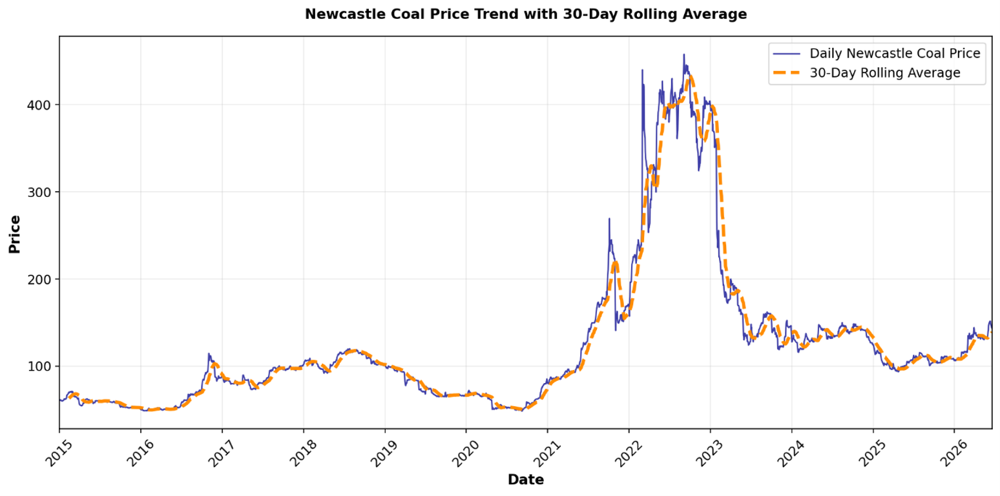
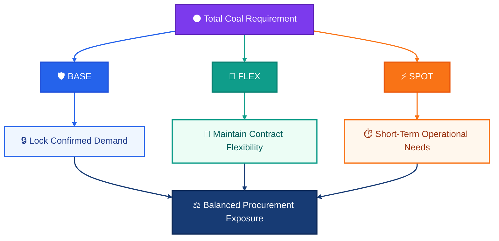

<div align="center">

# Newcastle Coal Price Forecasting & Procurement Optimization

### Multivariate Commodity Forecasting · Machine Learning · Time Series · Decision Analytics

<p>
  
  
  
  
  
  
</p>

### Market Intelligence → Forecasting → Decision Support

**An end-to-end commodity forecasting project combining Newcastle coal price history, global market signals and temporal features to support procurement timing, contract planning and price-risk decisions.**

</div>

---

<p align="center">
  <a href="#-business-problem">Business Problem</a> •
  <a href="#-market-intelligence">Market</a> •
  <a href="#-forecasting-methodology">Methodology</a> •
  <a href="#-model-performance">Performance</a> •
  <a href="#-jan-jun-2026-evaluation">Evaluation</a> •
  <a href="#-decision-intelligence">Decision Intelligence</a> •
  <a href="#-production-lifecycle">Production</a>
</p>

---

## 🎯 Business Problem

Coal prices do not move independently.

Newcastle Coal Futures are influenced by the wider energy and commodity ecosystem, including:

`LNG` · `Natural Gas` · `Crude Oil` · `Freight` · `Currencies` · `Carbon Pricing` · `Industrial Demand`

Instead of treating the task as a simple univariate forecasting problem, this project combines:

<div align="center">

### Historical Coal Behaviour + External Market Signals + Temporal Structure

</div>

The central question is not simply:

> *What will the next coal price be?*

It is:

> **Can market information improve our understanding of coal-price movement enough to support better procurement timing, contract planning and price-risk management?**

The objective is to move beyond prediction and build a **decision-support framework** that connects forecasting output with practical procurement actions.

---

## 🌍 Market Intelligence

### Historical Newcastle Coal Price Behaviour

<p align="center">
  
</p>

The historical series reveals several distinct commodity-market regimes.

| Period        | Market Environment | Interpretation                                   |
| ------------- | ------------------ | ------------------------------------------------ |
| **2015–2020** | Stable             | Relatively lower and more stable coal prices     |
| **2021**      | Transition         | Clear movement toward a higher-volatility regime |
| **2022**      | Extreme            | Exceptional price and volatility spike           |
| **2023**      | Correction         | Strong normalization following the peak          |
| **2024–2025** | Stabilization      | Comparatively more stable market conditions      |

This matters because the forecasting model must learn from both ordinary market behaviour and extreme commodity shocks.

> **Strong performance in one market regime does not guarantee identical behaviour after the market structure changes.**

---

### Market Signal Architecture

The forecasting model uses variables representing several dimensions of the global coal-pricing environment.

```text
                         GLOBAL MARKET
                              │
         ┌────────────────────┼────────────────────┐
         │                    │                    │
      ENERGY              CURRENCY              FREIGHT
         │                    │                    │
   Brent Oil           US Dollar Index      Baltic Dry Index
   Natural Gas         AUD/USD
   JKM LNG
         │
         ├─────────────────────────────────────────┐
         │                                         │
   POLICY / CARBON                            INDUSTRY
         │                                         │
Carbon Emissions Futures                    Iron Ore
                                                   │
                         ┌─────────────────────────┘
                         │
                    COAL PRICE
                         │
              ┌──────────┴──────────┐
              │                     │
        Calendar Structure      Price Memory
       Year / Month /          Lag 1 / Lag 7 /
          Quarter                 Lag 30
```

The final modelling dataset contains **14 predictors**.

JKM LNG, Natural Gas and Brent Oil showed some of the strongest positive historical relationships with Newcastle coal, while AUD/USD showed a negative relationship.

> **Correlation was used as a diagnostic signal, not as evidence of causality.**

Feature selection therefore combines **statistical evidence with commodity-market reasoning**.

---

## 🧠 Forecasting Methodology

The modelling strategy was built around three principles.

### 1. Preserve Time Order

Random train/test splitting was intentionally avoided.

```text
2015 ──────────────────────── 2023 │ 2024 │ 2025 │ Jan–Jun 2026
             TRAIN                  VALID   TEST      EVALUATION
```

```text
Past ───────────────────────────────────────────────────► Future
                         No Random Shuffle
```

Earlier observations always predict later observations.

`TimeSeriesSplit` was also used to evaluate how model performance changed across different historical periods.

---

### 2. Combine Market Context with Price Memory

```text
External Market Variables
            +
Calendar Features
            +
Coal Lag Features
            │
            ▼
       Feature Space
            │
            ▼
      Forecast Model
```

This allows the model to learn from both:

* what is happening **around coal**, and
* what coal itself has **recently been doing**.

---

### 3. Benchmark Complexity

A sophisticated forecasting model should earn its complexity.

| Model                    | Role                   | Purpose                                       |
| ------------------------ | ---------------------- | --------------------------------------------- |
| **Persistence Baseline** | Simple benchmark       | Previous available coal price                 |
| **XGBoost**              | Machine-learning model | Capture nonlinear feature interactions        |
| **SARIMAX**              | Statistical benchmark  | Model time structure with exogenous variables |

If a complex model cannot meaningfully outperform a simple benchmark, the additional complexity becomes difficult to justify.

---

## 🔄 End-to-End Workflow

```mermaid
flowchart LR
    A["Market Data"] --> B["Validation & Cleaning"]
    B --> C["Trading-Date Alignment"]
    C --> D["EDA & Market Analysis"]
    D --> E["Feature Engineering"]
    E --> F["Chronological Split"]

    F --> G["XGBoost"]
    F --> H["SARIMAX"]

    G --> I["Time-Series Validation"]
    H --> I

    I --> J["2025 Holdout"]
    J --> K["Jan-Jun 2026 Evaluation"]
    K --> L["Procurement Decision Support"]

    classDef data fill:#E8F1FF,stroke:#2563EB,color:#1E3A8A,stroke-width:1.5px;
    classDef model fill:#F3E8FF,stroke:#7C3AED,color:#4C1D95,stroke-width:1.5px;
    classDef eval fill:#ECFDF5,stroke:#0F9D8A,color:#065F5B,stroke-width:1.5px;
    classDef business fill:#FFF7ED,stroke:#F97316,color:#9A3412,stroke-width:1.5px;

    class A,B,C,D,E,F data;
    class G,H model;
    class I,J,K eval;
    class L business;
```



The workflow keeps **data preparation, modelling, validation and business interpretation** connected within one forecasting pipeline.

---

## ⚙️ Model Design

### XGBoost

XGBoost was used as the primary machine-learning candidate because commodity prices can respond to several market variables simultaneously and those relationships are not necessarily linear.

```text
                       COAL PRICE
                           ▲
                           │
       ┌───────────────────┼───────────────────┐
       │                   │                   │
 Recent Behaviour      Energy Markets      Market Context
       │                   │                   │
  Lag Features        LNG / Gas / Oil      FX / Freight
                                         Carbon / Industry
```

XGBoost can capture nonlinear relationships and interactions between these signals while incorporating recent coal-price behaviour.

### SARIMAX

SARIMAX was used as the classical statistical benchmark.

It combines historical time-series structure with external variables, creating a useful comparison against the feature-driven machine-learning approach.

---

## 📊 Model Performance

Final model selection was based on the **unseen 2025 holdout period**.

| Model       |    MAE ↓ |   RMSE ↓ |    MAPE ↓ |     R² ↑ |
| ----------- | -------: | -------: | --------: | -------: |
| **XGBoost** | **1.27** | **1.63** | **1.21%** | **0.93** |
| SARIMAX     |     1.94 |     2.25 |     1.84% |     0.86 |

### 2025 Holdout Model Comparison

<p align="center">
  
</p>

**RMSE was used as the primary model-selection metric** because larger forecast errors can have disproportionate consequences for procurement cost, budgeting and contract timing.

The selected XGBoost model achieved:

<div align="center">

| Metric   |    Result |
| -------- | --------: |
| **RMSE** |  **1.63** |
| **MAE**  |  **1.27** |
| **MAPE** | **1.21%** |
| **R²**   |  **0.93** |

</div>

XGBoost outperformed SARIMAX across all four final holdout metrics.

---

### Model Stability

Strong holdout performance is only one part of model evaluation.

XGBoost performance varied across historical time-series folds, demonstrating the effect of changing commodity-market regimes.


Commodity forecasting operates in a **non-stationary environment**.

> **Good holdout performance does not guarantee permanent future stability.**

This motivates continuous backtesting, monitoring and retraining in a production implementation.

---

## 📈 Jan-Jun 2026 Evaluation

The selected XGBoost model was evaluated across **120 available trading-day observations** from January to June 2026.

### Daily Actual vs Forecast

<p align="center">
  
</p>

The model captured the broader progression of the market:

```text
January
Lower-price environment
        │
        ▼
February
Gradual increase
        │
        ▼
March
Strong upward movement
        │
        ▼
April – May
Relatively stable range
        │
        ▼
June
Higher-price environment
```

The forecast did not reproduce every short-term movement perfectly, particularly around the late-March price spike.

This is important to communicate because professional model evaluation should show **both predictive strength and visible limitations**.

---

### Monthly Evaluation

| Month   | Actual Avg. | Forecast Avg. | Difference |
| ------- | ----------: | ------------: | ---------: |
| **Jan** |      108.27 |        109.20 |      +0.93 |
| **Feb** |      116.01 |        116.54 |      +0.53 |
| **Mar** |      134.63 |        136.71 |      +2.08 |
| **Apr** |      134.47 |        134.77 |      +0.30 |
| **May** |      132.24 |        132.32 |      +0.08 |
| **Jun** |      146.69 |        145.02 |      -1.67 |

The monthly forecast captured the broader movement from the lower January price environment toward stronger June prices.

---

## 🔍 Forecasting Caveat

The 2026 evaluation uses external market variables observed during the corresponding 2026 dates.

The result should therefore be interpreted as:

> **A retrospective out-of-sample evaluation conditional on observed exogenous variables**

rather than a pure six-month forecast generated only from information available on 31 December 2025.

A genuine ex-ante forecasting system would also require forecasts or scenarios for variables such as:

`Brent Oil` · `Natural Gas` · `JKM LNG` · `FX` · `Freight` · `Carbon Prices`

```text
                 Coal Price Forecast
                         ▲
                         │
       ┌─────────────────┼─────────────────┐
       │          │      │      │          │
     Brent       LNG    Gas     FX       Freight
    Forecast   Forecast Forecast Forecast Forecast
```

This distinction is essential when evaluating forecasting models that depend on external predictors.

---

## 💼 Decision Intelligence

### From Prediction to Procurement

Forecast accuracy creates business value only when it improves a decision.

The modelling output was therefore translated into a price-based procurement framework.

### Forecast-Based Decision Zones

| Forecast Price | Market View         | Decision Guidance                                  |
| -------------- | ------------------- | -------------------------------------------------- |
| **Below 115**  | Lower-price zone    | Prioritize base procurement or contract locking    |
| **115–135**    | Moderate-price zone | Use phased procurement and monitor the market      |
| **Above 135**  | Higher-price zone   | Limit spot exposure and review contract protection |

```text
                       FORECAST PRICE
                            │
          ┌─────────────────┼─────────────────┐
          │                 │                 │
        < 115            115–135            > 135
          │                 │                 │
          ▼                 ▼                 ▼
     Secure Base        Buy in Phases      Limit Spot
       Demand            + Monitor          Exposure
```

These thresholds are intended as a **decision-support framework**, not automatic trading rules.

---

### Jan-Jun Procurement View

| Month   | Forecast Avg. | Market View    | Potential Action                      |
| ------- | ------------: | -------------- | ------------------------------------- |
| **Jan** |        109.20 | Lower          | Secure part of base demand            |
| **Feb** |        116.54 | Moderate       | Continue phased procurement           |
| **Mar** |        136.71 | Higher         | Reduce large spot exposure            |
| **Apr** |        134.77 | Upper-Moderate | Use need-based procurement            |
| **May** |        132.32 | Moderate       | Review limited top-up opportunity     |
| **Jun** |        145.02 | Higher         | Avoid unnecessary unplanned purchases |

---

### Base–Flex–Spot Strategy



**Base**
Protect confirmed requirements from potential future price increases.

**Flex**
Preserve contractual flexibility if demand or market conditions change.

**Spot**
Keep exposure controlled and use primarily for short-term operational requirements.

The objective is to balance:

**Cost Protection · Demand Uncertainty · Working Capital · Inventory Risk · Market Flexibility**

---

## 🧾 Business Recommendations

| Area              | Recommendation                                                                 |
| ----------------- | ------------------------------------------------------------------------------ |
| **Procurement**   | Secure part of confirmed demand during relatively lower-price periods          |
| **Contracting**   | Use phased or split contracts rather than one concentrated entry point         |
| **Spot Exposure** | Reduce unnecessary spot buying during higher-price conditions                  |
| **Inventory**     | Build additional inventory only when expected savings justify carrying cost    |
| **Risk**          | Review fixed-price or partial hedging structures for confirmed future exposure |
| **Monitoring**    | Track LNG, gas, Brent, freight, FX and carbon markets                          |
| **Forecasting**   | Refresh forecasts before major procurement or contract decisions               |

> **The model should support procurement judgement — not replace it.**

---

## ♻️ Production Lifecycle

A production forecasting system should operate as a **continuous learning cycle**, rather than as a one-time notebook execution.


### Production Enhancements

A production-grade version could extend the current workflow with:

`Automated Data Ingestion` · `Walk-Forward Forecasting` · `Prediction Intervals`

`SHAP Explainability` · `Market-Regime Detection` · `Feature Drift Monitoring`

`Model Performance Monitoring` · `External-Variable Forecasting`

`Scheduled Retraining` · `Scenario-Based Forecasting`

The initial lag-value backfilling approach should also be replaced with a proper **warm-up period**, removing observations that do not yet have valid historical lag information.

---

## 🛠️ Technology Stack

| Layer                | Technologies                            |
| -------------------- | --------------------------------------- |
| **Programming**      | Python                                  |
| **Data Processing**  | Pandas · NumPy                          |
| **Machine Learning** | XGBoost · scikit-learn                  |
| **Time Series**      | SARIMAX · Statsmodels · TimeSeriesSplit |
| **Visualization**    | Matplotlib · Seaborn                    |
| **Development**      | Google Colab · Jupyter Notebook         |
| **Version Control**  | Git · GitHub                            |

---

## 📁 Repository Architecture

```text
newcastle-coal-price-forecasting/
│
├── README.md
├── requirements.txt
├── LICENSE
│
├── notebooks/
│   └── newcastle_coal_price_forecasting.ipynb
│
├── data/
│   └── processed/
│       ├── cleaned_master_dataset.csv
│       └── model_ready_coal_forecasting_data.csv
│
├── outputs/
│   └── newcastle_coal_forecast_2026.csv
│
└── assets/
    ├── coal_price_historical_trend.png
    ├── model_rmse_comparison.png
    └── actual_vs_forecast_2026.png
```

---

## 💡 Key Takeaways

* **Time-aware validation matters.** Future observations should never leak into model training.
* **Simple baselines matter.** Complex models should demonstrate measurable additional value.
* **Commodity markets change regimes.** Validation should assess performance across different market conditions.
* **Feature engineering requires domain logic.** Correlation alone should not determine model inputs.
* **Strong holdout performance is not permanent.** Models require ongoing monitoring after deployment.
* **External predictors create additional forecasting requirements.** Unknown future exogenous variables must also be forecast or scenario-modelled.
* **Uncertainty should be communicated.** Forecasting should not imply precision that the data cannot support.
* **Predictions become valuable when they improve decisions.**

---

## ⚠️ Limitations

<details>
<summary><b>Data Source</b></summary>

<br>

Historical datasets were collected from publicly accessible CSV sources rather than an automated institutional market-data feed.

A production implementation would require stronger data governance, licensing controls, automated ingestion and quality monitoring.

</details>

<details>
<summary><b>Exogenous Variables</b></summary>

<br>

The 2026 evaluation uses observed external market values.

A live forecasting implementation would require independent forecasts or scenarios for those variables.

</details>

<details>
<summary><b>Market Shocks</b></summary>

<br>

Geopolitical events, supply disruptions, policy changes, extreme weather and structural market shifts can create price behaviour not represented by historical relationships.

</details>

<details>
<summary><b>Model Stability</b></summary>

<br>

Performance on the 2025 holdout does not guarantee equal accuracy across future commodity-market regimes.

Continuous monitoring, rolling validation and periodic retraining would therefore be required.

</details>

---

## 📚 Data & Reproducibility

Historical market data was sourced from publicly accessible **Investing.com historical CSV datasets** and aligned to the Newcastle Coal Futures trading calendar.

The repository contains processed datasets required to inspect the modelling workflow.

Third-party market data remains subject to the original provider's applicable terms.

---

## ⚖️ Disclaimer

This project is intended for **research, learning and portfolio demonstration purposes**.

The forecasts and procurement framework should be interpreted as analytical decision-support outputs and not as financial, investment, hedging or commercial advice.

---

<div align="center">


### Data → Models → Insights → Decisions

`Machine Learning` · `Time Series Forecasting` · `Statistical Modelling` · `Decision Analytics`

</div>
